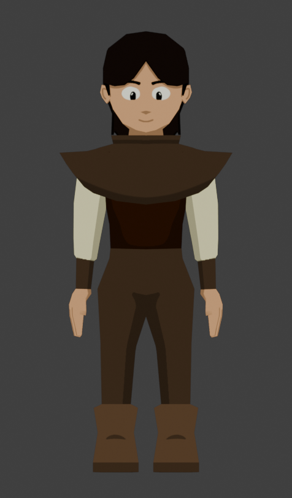

# Knights and Knaves
## Gameplay
- Turn Based Combat System
- World Map
- Each npc is either a knight or knave
  - Knights: can only tell the truth
  - Knaves: can only lie
- Recruitable party members who are knights/knaves
- Minigames/Puzzles

## Roadmap
### 0.1: Proof Of Concept [Basic Mechanics]
- [X] 3D movement
- [X] Implement fixed camera angle system
- [ ] Improve camera system by adding advanced types of cameras (ie. follow the player, rotate towards the player, etc.)
- [ ] Create some test pre-rendered backgrounds for each camera angle in blender as well as a collison mesh for the area
- [X] Build test scene [Improvement Needed]
- [X] Temporary character model with basic animation
- [X] NPC scene
- [X] Cel-Shader [Could be improved]
- [ ] HUD
- [X] Dialogue system [Could be refined some more]
- [ ] Combat
### 0.2: Proof Of Concept [Advanced Mechanics]
- [ ] Party System
- [ ] UI
- [ ] Make several more characters and animations
### 0.3: Proof Of Concept [Aesthetic + Final Touches]
- [ ] Town scene
- [ ] Modeled characters
- [ ] Maybe make party members follow you around world map and levels

## Tech Stack
- Godot 4.3
- C#
- Blender
- Visual Studio Code

## Images

## Videos
[Daily Showcase Playlist](https://www.youtube.com/watch?v=QhWuJ_pk5-A&list=PLE9KDpgiOyFDyoT6gnDmB5Nd-Xvu2F3We)
