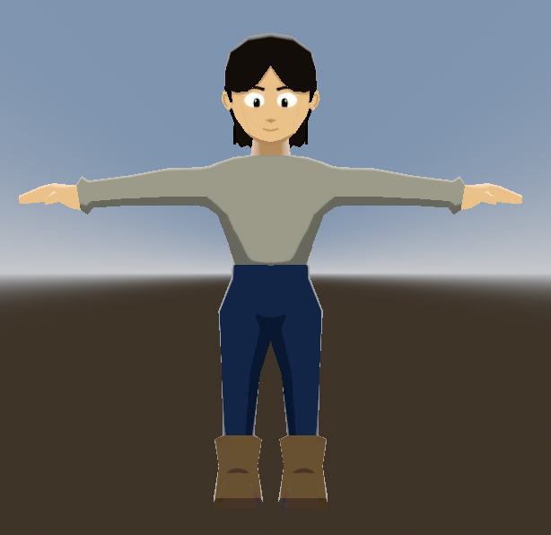
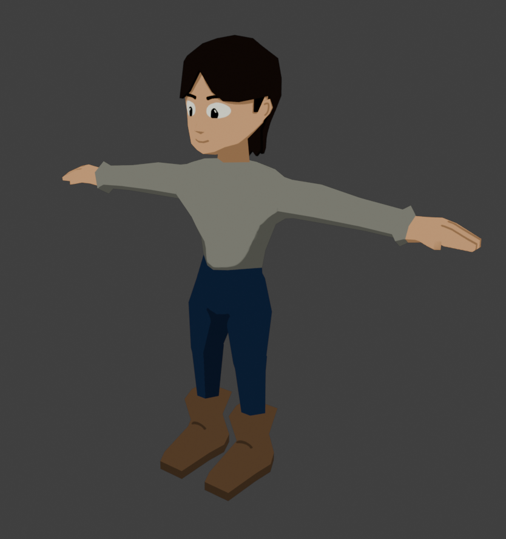

# Knights and Knaves
## Gameplay
  
| Class         | Speed (Max Speed)            | Attack Range (falloff)   | Attack Strength (1-3) |
| ------------- | ---------------------------- | ------------------------ |---------------------- |
| 🔵 Hero      | 1(2)                          | 2 (1+)                  | 2                      |
| 🔴 Brute     | 0(1)                          | 1                       | 3                      |
| 🟡 Ranger    | 1(2)                          | 3 (2-)                  | 2                      | 
| 🟢 Thief     | 2(3)                          | 2 (1+)                  | 1                      |
| ⚪ Healer?   |                               |                         |                        |
| 🟣 Special   | -                             | -                       | -                      |
- Turn based [3 rank hexagon combat system](https://github.com/braydenphanna/knights-and-knaves/blob/main/screenshots/battlegraph.png)
  - Editable default battle orientation
  - 3 person party
  - Each turn you have movement and attack(unless you're brute). You can sacrifice attack for +1 movement.
  - Damage falloff (+ means above, - means below)
  - Special class is for unique enemies
  - Due to Hexagonal setup the middle rank can attack more spots, but also can be attacked from more directions 
- World Map
- Each npc is either a knight or knave
  - Knights: can only tell the truth
  - Knaves: can only lie
- Recruitable party members who are knights/knaves
- Minigames/Puzzles

## Roadmap
### 0.1: Proof Of Concept [Basic Mechanics]
- [X] 3D movement
- [X] Rotatable 3rd person camera with mouse
- [X] Build test scene [Improvement Needed]
- [X] Temporary character model with basic animation
- [X] NPC scene
- [ ] Dialogue system
- [ ] Combat
### 0.2: Proof Of Concept [Advanced Mechanics]
- [ ] Party System
- [ ] Make several more characters and animations
- [ ] UI
### 0.3: Proof Of Concept [Aesthetic + Final Touches]
- [ ] Town scene
- [ ] Modeled characters
- [ ] Party members follow you around world map and levels

## Tech Stack
- Godot 4.3
- C#
- Blender
- Visual Studio Code

## Inspiration
- FF7 + FF9
- Xenogears
- Disco Elysium
- Greed Island
- Kingdom Hearts/Disney
- Windwaker

## Images
 

## Videos
[Showcase Playlist](https://www.youtube.com/watch?v=QhWuJ_pk5-A&list=PLE9KDpgiOyFDyoT6gnDmB5Nd-Xvu2F3We)
