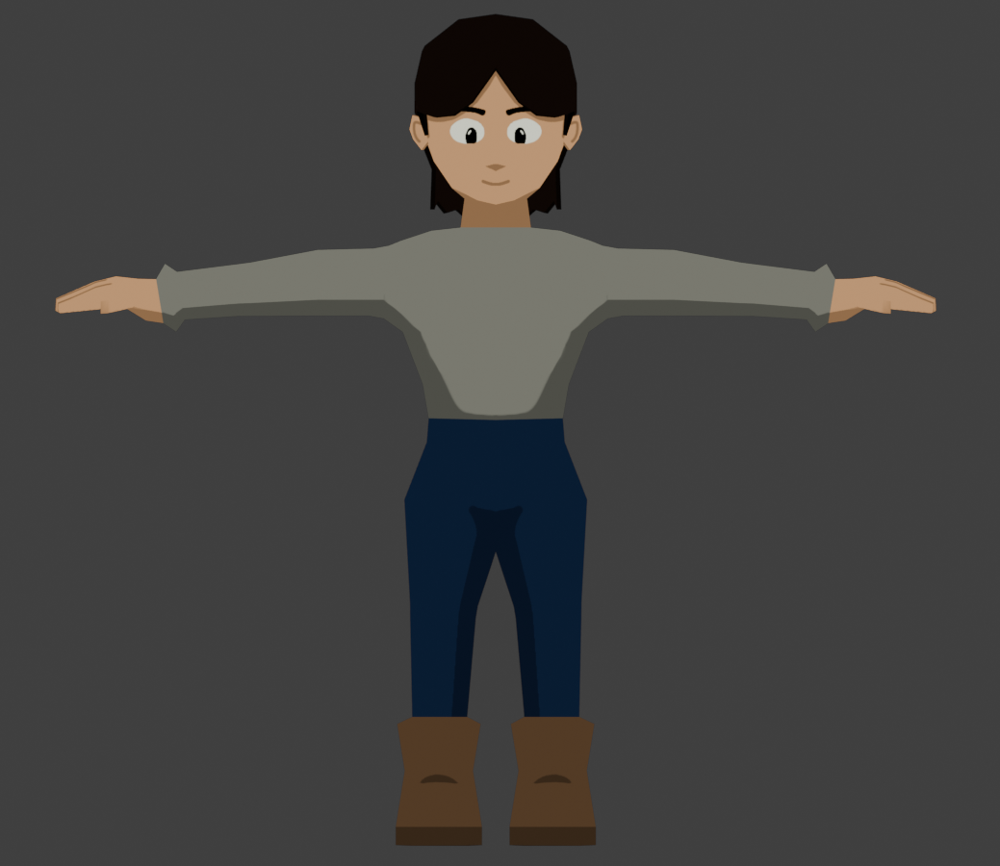

# Knights and Knaves

## Tech Stack
- Godot 
- C#
- Blender 

## Gameplay
- Turn based combat
  - OCTAGON / CIRCLE COMBAT + EDITABLE BATTLE ENTER ORIENTATION 
  - LIKE DND CAN MOVE 1 SPOT OVER AND ATTACK OR 2 SPOTS OVER
- World Map
- Each npc is either a knight or knave
  - Knights: can only tell the truth
  - Knaves: can only lie
- Recruitable party members who are knights/knaves
- Player character either
  - Can choose knight or knave
  - neither (leaning towards this)
- Logic puzzles
- Minigames

## Graphics
- ff9-like chibi cartoon characters
- FMVs

## Story
- Medieval Quest
- Sympathetic Knave character 
- Some npc’s assignment is obvious, others not
- Player is an outsider
- Some sort of mechanism to reveal who is a knight or knave
- Some sort of higher power / wizardry assigning knights / knaves

## Roadmap
### 0.1: Proof Of Concept [Basic Mechanics]
- [X] 3D movement
- [X] Rotatable 3rd person camera with mouse
- [X] Build test scene [Improvement Needed]
- [X] NPC scene
- [ ] Dialogue system
- [ ] Initiate combat
- [ ] Combat sequence
- [X] Temporary character model with animations [Needs major work]
- [ ] UI
### 0.2: Proof Of Concept [Advanced Mechanics]
- [ ] Party System
### 0.3: Proof Of Concept [Aesthetic + Final Touches]
- [ ] Town scene
- [ ] Modeled characters
- [ ] Refined UI
### X.X: Future
- [ ] Party members follow you

## Inspiration
- FF7 + FF9
- Xenogears
- Disco Elysium
- Greed Island
- Kingdom Hearts/Disney
- Windwaker

## Images
 
## Videos
[Showcase Playlist](https://www.youtube.com/watch?v=QhWuJ_pk5-A&list=PLE9KDpgiOyFDyoT6gnDmB5Nd-Xvu2F3We)
